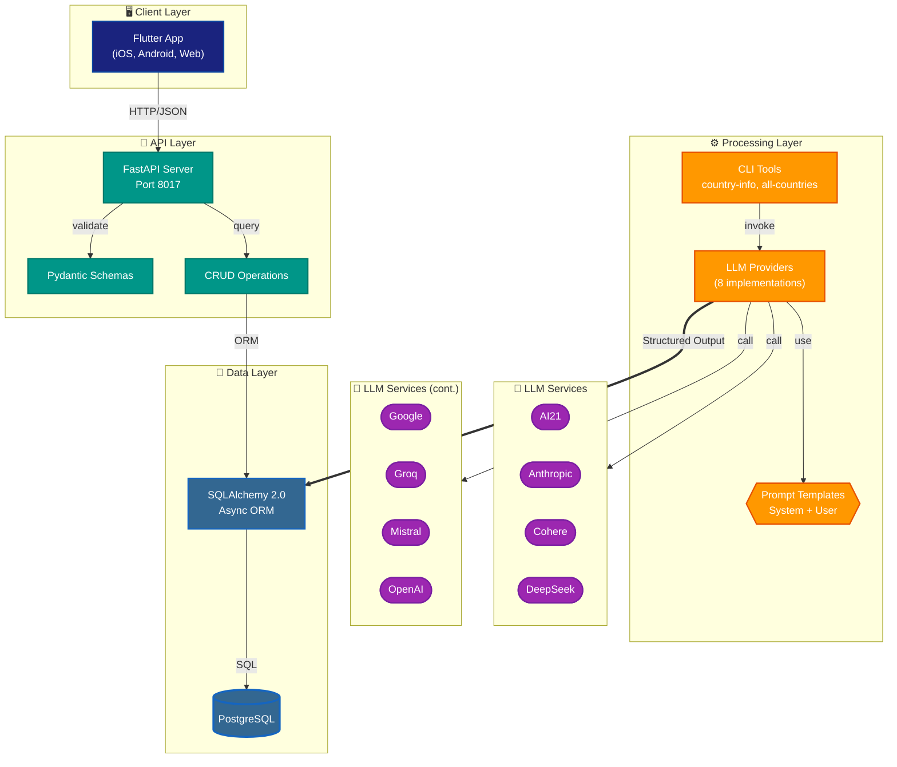

# llm-interactions-for-structured-outputs

Programmatically process structured outputs from 8 LLM providers and display country/city data in a Flutter application.

## Supported LLM Providers

1. AI21 (Jamba)
2. Anthropic (Claude)
3. Cohere (Command R+)
4. DeepSeek (Chat)
5. Google (Gemini)
6. Groq (Llama)
7. Mistral (Large)
8. OpenAI (GPT-4o)

## System Architecture



## Quick Start

See the [Operations Runbook](administration/runbook.md) for detailed setup and usage instructions:

- Backend setup (FastAPI + PostgreSQL)
- Database table creation and migrations
- CLI tools for processing country data
- Flutter app configuration
- API endpoint reference

## Project Structure

```
├── backend/                 # FastAPI backend
├── database/               # SQL scripts and Python wrappers
├── flutter_app/            # Flutter cross-platform app
├── process_structured_output/  # LLM provider CLIs
├── utilities/              # Helper modules (countries_info, color_palette, glossary)
├── glossary/               # Economic indicator definitions (CSV)
├── countries/              # Country-LLM assignments (CSV)
└── administration/         # Runbook and operational docs
```

## Documentation

- **[Operations Runbook](administration/runbook.md)** - Complete setup, CLI usage, and troubleshooting
- **[Architecture](llm-interaction-strategies/llm-interaction-architecture.md)** - System diagrams and design decisions
- **[LLM Strategy Comparison](llm-interaction-strategies/llm-strategy-comparison.md)** - Provider capabilities and structured output approaches
