# llm-interactions-for-structured-outputs

Programmatically process structured outputs from 8 LLM providers and display country/city data in a Flutter application.

## Supported LLM Providers

1. AI21 (Jamba)
2. Anthropic (Claude)
3. Cohere (Command R+)
4. DeepSeek (Chat)
5. Google (Gemini)
6. Groq (Llama)
7. Mistral (Large)
8. OpenAI (GPT-4o)

## System Architecture

```mermaid
%%{init: {'theme': 'default'}}%%
flowchart TB
    subgraph Client["🖥️ Client Layer"]
        Flutter["Flutter App<br/>(iOS, Android, Web)"]:::client
    end

    subgraph API["🔌 API Layer"]
        FastAPI["FastAPI Server<br/>Port 8017"]:::api
        Pydantic["Pydantic Schemas"]:::api
        CRUD["CRUD Operations"]:::api
    end

    subgraph Processing["⚙️ Processing Layer"]
        CLI["CLI Tools<br/>country-info, all-countries"]:::processing
        Providers["LLM Providers<br/>(8 implementations)"]:::processing
        Prompts{{"Prompt Templates<br/>System + User"}}:::processing
    end

    subgraph LLMs["🤖 LLM Services"]
        direction LR
        AI21(["AI21"]):::llm
        Anthropic(["Anthropic"]):::llm
        Cohere(["Cohere"]):::llm
        DeepSeek(["DeepSeek"]):::llm
    end

    subgraph LLMs2["🤖 LLM Services (cont.)"]
        direction LR
        Google(["Google"]):::llm
        Groq(["Groq"]):::llm
        Mistral(["Mistral"]):::llm
        OpenAI(["OpenAI"]):::llm
    end

    subgraph Data["💾 Data Layer"]
        SQLAlchemy["SQLAlchemy 2.0<br/>Async ORM"]:::data
        PostgreSQL[(PostgreSQL)]:::database
    end

    Flutter -->|HTTP/JSON| FastAPI
    FastAPI -->|validate| Pydantic
    FastAPI -->|query| CRUD
    CRUD -->|ORM| SQLAlchemy
    SQLAlchemy -->|SQL| PostgreSQL

    CLI -->|invoke| Providers
    Providers -->|use| Prompts
    Providers -->|call| LLMs
    Providers -->|call| LLMs2
    Providers ==>|Structured Output| SQLAlchemy

    classDef client fill:#1A237E,stroke:#0D47A1,color:#fff,stroke-width:2px
    classDef api fill:#009688,stroke:#00796B,color:#fff,stroke-width:2px
    classDef processing fill:#FF9800,stroke:#E65100,color:#fff,stroke-width:2px
    classDef llm fill:#9C27B0,stroke:#7B1FA2,color:#fff,stroke-width:2px
    classDef data fill:#336791,stroke:#1565C0,color:#fff,stroke-width:2px
    classDef database fill:#336791,stroke:#1565C0,color:#fff,stroke-width:3px
```



## Quick Start

See the [Operations Runbook](administration/runbook.md) for detailed setup and usage instructions:

- Backend setup (FastAPI + PostgreSQL)
- Database table creation and migrations
- CLI tools for processing country data
- Flutter app configuration
- API endpoint reference

## Project Structure

```
├── backend/                 # FastAPI backend
├── database/               # SQL scripts and Python wrappers
├── flutter_app/            # Flutter cross-platform app
├── process_structured_output/  # LLM provider CLIs
├── utilities/              # Helper modules (countries_info, color_palette, glossary)
├── glossary/               # Economic indicator definitions (CSV)
├── countries/              # Country-LLM assignments (CSV)
└── administration/         # Runbook and operational docs
```

## Documentation

- **[Operations Runbook](administration/runbook.md)** - Complete setup, CLI usage, and troubleshooting
- **[Architecture](llm-interaction-strategies/llm-interaction-architecture.md)** - System diagrams and design decisions
- **[LLM Strategy Comparison](llm-interaction-strategies/llm-strategy-comparison.md)** - Provider capabilities and structured output approaches
