# LLM Interaction Architecture

A comprehensive visual guide to the **llm-interactions-for-structured-outputs** project architecture.

---

## 1. System Overview

The project follows a multi-tier architecture with Flutter frontend, FastAPI backend, and multi-provider LLM integration for structured data extraction.

```mermaid
%%{init: {
  'theme': 'default'
}}%%
flowchart TB
    subgraph Client["🖥️ Client Layer"]
        Flutter["Flutter App<br/>(iOS, Android, Web)"]:::client
    end

    subgraph API["🔌 API Layer"]
        FastAPI["FastAPI Server<br/>Port 8017"]:::api
        Pydantic["Pydantic Schemas"]:::api
        CRUD["CRUD Operations"]:::api
    end

    subgraph Processing["⚙️ Processing Layer"]
        CLI["CLI Tools<br/>country-info, all-countries"]:::processing
        Providers["LLM Providers<br/>(8 implementations)"]:::processing
        Prompts{{"Prompt Templates<br/>System + User"}}:::processing
    end

    subgraph LLMs["🤖 LLM Services"]
        direction LR
        AI21(["AI21"]):::llm
        Anthropic(["Anthropic"]):::llm
        Cohere(["Cohere"]):::llm
        DeepSeek(["DeepSeek"]):::llm
    end

    subgraph LLMs2["🤖 LLM Services (cont.)"]
        direction LR
        Google(["Google"]):::llm
        Groq(["Groq"]):::llm
        Mistral(["Mistral"]):::llm
        OpenAI(["OpenAI"]):::llm
    end

    subgraph Data["💾 Data Layer"]
        SQLAlchemy["SQLAlchemy 2.0<br/>Async ORM"]:::data
        PostgreSQL[(PostgreSQL)]:::database
    end

    Flutter -->|HTTP/JSON| FastAPI
    FastAPI -->|validate| Pydantic
    FastAPI -->|query| CRUD
    CRUD -->|ORM| SQLAlchemy
    SQLAlchemy -->|SQL| PostgreSQL

    CLI -->|invoke| Providers
    Providers -->|use| Prompts
    Providers -->|call| LLMs
    Providers -->|call| LLMs2
    Providers ==>|Structured Output| SQLAlchemy

    classDef client fill:#1A237E,stroke:#0D47A1,color:#fff,stroke-width:2px
    classDef api fill:#009688,stroke:#00796B,color:#fff,stroke-width:2px
    classDef processing fill:#FF9800,stroke:#E65100,color:#fff,stroke-width:2px
    classDef llm fill:#9C27B0,stroke:#7B1FA2,color:#fff,stroke-width:2px
    classDef data fill:#336791,stroke:#1565C0,color:#fff,stroke-width:2px
    classDef database fill:#336791,stroke:#1565C0,color:#fff,stroke-width:3px
```



---

## 2. Technology Stack

| Layer | Technology | Version | Purpose |
|:------|:-----------|:--------|:--------|
| **Frontend** | Flutter | 3.x | Cross-platform UI (iOS, Android, Web) |
| **API** | FastAPI | 0.100+ | High-performance async REST API |
| **Database** | PostgreSQL | 15+ | Relational data storage |
| **ORM** | SQLAlchemy | 2.0 | Async database abstraction |
| **Validation** | Pydantic | 2.x | Data validation & JSON schemas |
| **HTTP Client** | http (Dart) | - | Flutter API communication |

### Python Package Structure

```
project-root/
├── backend/                    # FastAPI application
│   └── app/
│       ├── api/v1/            # REST endpoints
│       ├── crud/              # Database operations
│       ├── models/            # SQLAlchemy models
│       └── schemas/           # Pydantic schemas
│
├── process_structured_output/  # LLM CLI tools
│   └── src/
│       ├── providers/         # 8 LLM provider classes
│       ├── models/            # Pydantic response models
│       ├── prompts/           # Reusable prompt templates
│       └── db/                # Database operations
│
├── database/                   # SQL migrations
│   └── sql/tables/            # Table definitions
│
└── utilities/                  # Shared utilities
    ├── countries_info.py      # Country data queries
    ├── color_palette.py       # Color scale calculations
    └── glossary.py            # Glossary management
```

---

## 3. LLM Integration Strategy

### 3.1 Structured Output Flow


### 3.2 Provider Support Matrix

| Provider | SDK | Model | Schema Support | Response Access |
|:---------|:----|:------|:---------------|:----------------|
| **AI21** | `ai21` | jamba-large | `json_object` | `.choices[0].message.content` |
| **Anthropic** | `anthropic` | claude-sonnet-4-5 | **Pre-validated** | `.parsed_output` |
| **Cohere** | `cohere` | command-a-03-2025 | `json_schema` | `.text` |
| **DeepSeek** | `openai` + base_url | deepseek-chat | `json_object` | `.choices[0].message.content` |
| **Google** | `google.genai` | gemini-2.5-flash | `response_json_schema` | `.text` |
| **Groq** | `groq` | llama-4-scout-17b | `json_schema` | `.choices[0].message.content` |
| **Mistral** | `mistralai` | mistral-small-latest | `json_schema` | `.choices[0].message.content` |
| **OpenAI** | `openai` | gpt-4o | **Pre-validated** | `.parsed` |

### 3.3 Validation Paths


---

## 4. Data Layer

### 4.1 Database Schema


### 4.2 Tables Overview

| Table | Records | Description |
|:------|:--------|:------------|
| `ai_models` | 8 | LLM provider/model registry tracking which model generated data |
| `continents` | 7 | Geographic data for all 7 continents |
| `countries` | 80 | 25 economic/quality-of-life indicators per country (10 per LLM) |
| `cities` | ~400 | Major cities with safety indices (5 per country) |
| `glossary` | 8 | Definitions of economic indicators used in the app |

---

## 5. API Layer

### 5.1 Endpoint Structure

```mermaid
%%{init: {'theme': 'default'}}%%
flowchart LR
    subgraph Endpoints["🔌 FastAPI Endpoints"]
        direction TB
        Health(["/api/v1/health<br/>GET"]):::health
        Models["/api/v1/ai-models<br/>GET"]:::endpoint
        Continents["/api/v1/continents<br/>GET"]:::endpoint
        Countries["/api/v1/countries<br/>GET"]:::endpoint
        Cities["/api/v1/cities<br/>GET"]:::endpoint
        Glossary["/api/v1/glossary<br/>GET"]:::endpoint
    end

    subgraph Filters["🔍 Query Filters"]
        ContinentFilter[/"?continent=Asia"/]:::filter
        CountryFilter[/"?country_id=1"/]:::filter
    end

    Countries -->|filter by| ContinentFilter
    Cities -->|filter by| CountryFilter

    classDef health fill:#4CAF50,stroke:#2E7D32,color:#fff,stroke-width:2px
    classDef endpoint fill:#1A237E,stroke:#0D47A1,color:#fff,stroke-width:2px
    classDef filter fill:#E8EAF6,stroke:#9FA8DA,color:#000,stroke-width:2px
```



### 5.2 API Endpoints

| Endpoint | Method | Description | Query Params |
|:---------|:-------|:------------|:-------------|
| `/api/v1/health` | GET | Health check | - |
| `/api/v1/ai-models` | GET | List all LLM models | - |
| `/api/v1/continents` | GET | List all continents | - |
| `/api/v1/countries` | GET | List countries | `?continent=` |
| `/api/v1/cities` | GET | List cities by country | `?country_id=` |
| `/api/v1/glossary` | GET | List indicator definitions | - |

### 5.3 API Request Flow


---

## 6. Reusable Components

### 6.1 Pydantic Models

```
process_structured_output/src/process_structured_output/models/
├── continent.py
│   ├── ContinentInfo (5 fields)
│   └── ModelIdentity (2 fields)
│
└── country.py
    ├── CountryInfo (21 fields)
    ├── CityInfo (13 fields)
    └── CitiesResponse (list wrapper)
```

**Key Models:**

| Model | Fields | Purpose |
|:------|:-------|:--------|
| `CountryInfo` | 21 | Country economic indicators (GDP, PPP, life expectancy, etc.) |
| `CityInfo` | 13 | City data with safety indices (SCI, Numbeo SI/CI) |
| `ContinentInfo` | 5 | Continent geographic data |
| `ModelIdentity` | 2 | LLM provider/model identification |

### 6.2 Prompt Templates

The project uses a two-part prompt system:

```python
# System Prompt (Role Definition)
COUNTRY_SYSTEM_PROMPT = """
You are a helpful AI assistant with expert knowledge on world geography,
economics, and quality-of-life indicators. Respond with accurate data
in the exact JSON format requested.
"""

# User Prompt (Query Template)
def get_country_user_prompt(country_name: str) -> str:
    return f"""
    Please provide detailed information about {country_name} including:
    - Economic indicators (GDP, PPP, inflation, unemployment)
    - Quality-of-life metrics (life expectancy, happiness index)
    - Safety indices (Global Peace Index, travel risk level)

    Return as JSON with the following fields: ...
    """
```

**Prompt Files:**
- `prompts/country_prompts.py` - Country and city prompt templates
- `prompts/city_prompts.py` - City-specific prompts

---

## 7. CLI Tools

### 7.1 Available Commands

| Command | Package | Description |
|:--------|:--------|:------------|
| `country-info` | process_structured_output | Get country info from any LLM |
| `all-countries-{provider}` | process_structured_output | Batch process 10 countries |
| `continent-info` | process_structured_output | Get continent data |
| `countries-info` | utilities | Query countries.csv |
| `glossary` | utilities | Manage glossary entries |

### 7.2 Usage Examples

```bash
# Get country info from OpenAI
uv run country-info --provider openai --country "Japan"

# Batch process countries with Anthropic
uv run all-countries-anthropic

# Query country data
uv run countries-info --continent Asia

# Manage glossary
uv run glossary --list
```

---

## 8. Data Flow Summary


---

## 9. Flutter Application

### 9.1 Architecture


### 9.2 Key Screens

| Screen | Description | Key Widgets |
|:-------|:------------|:------------|
| **LandingScreen** | Main dashboard with continent carousel | ContinentCarousel, GlobeFabMenu, InfoNavPanel |
| **GlobalHeatmapsScreen** | Country comparison heatmap | HeatmapGrid, HeatmapFilters, HeatmapAttributeDropdown |
| **HealthScreen** | API health check display | StatusCard |

### 9.3 Widget Library

```
flutter_app/lib/widgets/
├── app_navigation_drawer.dart    # Main navigation drawer
├── breadcrumb.dart               # Navigation breadcrumb
├── city_safety_chart.dart        # Bar chart for city safety
├── continent_card.dart           # Carousel card
├── continent_carousel.dart       # Horizontal continent scroller
├── continent_cities_content.dart # City list by continent
├── continent_countries_panel.dart# Country list panel
├── continent_info_panel.dart     # Continent details
├── country_selector.dart         # Country dropdown
├── globe_fab_menu.dart           # Floating action menu
├── glossary_card.dart            # Expandable glossary entry
├── glossary_content.dart         # Glossary list
├── heatmap_attribute_dropdown.dart# Attribute selector
├── heatmap_cell.dart             # Single heatmap cell
├── heatmap_content.dart          # Main heatmap view
├── heatmap_filters.dart          # Continent/LLM filters
├── heatmap_grid.dart             # Country×LLM grid
├── info_nav_panel.dart           # Left navigation panel
├── status_card.dart              # Health status card
└── travel_safety_content.dart    # Travel safety view
```

---

## 10. Environment Variables

| Variable | Provider | Description |
|:---------|:---------|:------------|
| `AI21_API_KEY` | AI21 | AI21 API key |
| `ANTHROPIC_API_KEY` | Anthropic | Anthropic API key |
| `CO_API_KEY` | Cohere | Cohere API key |
| `DEEPSEEK_API_KEY` | DeepSeek | DeepSeek API key |
| `GEMINI_API_KEY` | Google | Google Gemini API key |
| `GROQ_API_KEY` | Groq | Groq API key |
| `MISTRAL_API_KEY` | Mistral | Mistral API key |
| `OPENAI_API_KEY` | OpenAI | OpenAI API key |
| `DATABASE_URL` | PostgreSQL | Database connection string |

---

*Last Updated: 2026-01-19 (mermaid-expert styling applied)*
