# LLM Structured Output Idiosyncrasies

A focused guide to the quirks, gotchas, and workarounds when working with structured outputs across 8 LLM providers.

---

## Quick Reference: Idiosyncrasy Map


---

## Schema Enforcement Levels

```mermaid
%%{init: {'theme': 'base', 'themeVariables': {'primaryColor': '#1A237E'}}}%%
flowchart LR
    subgraph Strict["🟢 Strict Enforcement"]
        direction TB
        S1["OpenAI"]:::strict
        S2["Anthropic"]:::strict
        S_DESC["API guarantees<br/>schema compliance"]:::descStrict
    end

    subgraph Enforced["🔵 API Enforced"]
        direction TB
        E1["Cohere"]:::enforced
        E2["Groq"]:::enforced
        E3["Mistral"]:::enforced
        E4["Google"]:::enforced
        E_DESC["API validates<br/>against schema"]:::descEnforced
    end

    subgraph JSONOnly["🟡 JSON Only"]
        direction TB
        J1["DeepSeek"]:::jsononly
        J_DESC["Valid JSON<br/>Schema NOT enforced"]:::descJson
    end

    subgraph None["🔴 No Enforcement"]
        direction TB
        N1["AI21"]:::none
        N_DESC["Prompt-based<br/>guidance only"]:::descNone
    end

    Strict --> Enforced --> JSONOnly --> None

    classDef strict fill:#1B5E20,stroke:#1B5E20,color:#fff
    classDef enforced fill:#0D47A1,stroke:#0D47A1,color:#fff
    classDef jsononly fill:#E65100,stroke:#E65100,color:#fff
    classDef none fill:#B71C1C,stroke:#B71C1C,color:#fff
    classDef descStrict fill:#C8E6C9,stroke:#A5D6A7,color:#1B5E20
    classDef descEnforced fill:#BBDEFB,stroke:#90CAF9,color:#0D47A1
    classDef descJson fill:#FFE0B2,stroke:#FFCC80,color:#E65100
    classDef descNone fill:#FFCDD2,stroke:#EF9A9A,color:#B71C1C

    style Strict fill:#2E7D32,stroke:#1B5E20,color:#fff
    style Enforced fill:#1976D2,stroke:#1565C0,color:#fff
    style JSONOnly fill:#F57C00,stroke:#E65100,color:#fff
    style None fill:#C62828,stroke:#B71C1C,color:#fff
    classDef desc fill:#E8EAF6,stroke:#C5CAE9,color:#1A237E,font-size:10px
```



---

## Provider-Specific Idiosyncrasies

### DeepSeek

| Quirk | Severity | Description |
|-------|----------|-------------|
| **"json" keyword required** | Critical | Prompt MUST contain the word "json" for JSON mode to work |
| **Empty responses** | High | May return empty content; use 5 retries (vs 3 for others) |
| **Self-identification failure** | Medium | Sometimes identifies as "Google Gemini" |
| **No schema enforcement** | Medium | Only `json_object` mode, not `json_schema` |

```python
# CRITICAL: This will FAIL
messages=[{"role": "user", "content": "Return country data"}]
response_format={"type": "json_object"}  # Error!

# This WORKS - includes "json" in prompt
messages=[{"role": "user", "content": "Return country data as JSON"}]
response_format={"type": "json_object"}  # OK
```

---

### Cohere

| Quirk | Severity | Description |
|-------|----------|-------------|
| **No maxLength constraint** | Medium | Schema `maxLength` not supported |
| **Comma-separated numbers** | High | Returns `3,796,742` instead of `3796742` |
| **Markdown code blocks** | Medium | May wrap JSON in triple backticks |
| **Rate limiting** | Medium | 429 errors require 10+ second delays |

```python
# JSON Sanitization Required for Cohere
def _sanitize_json(content: str) -> str:
    # Remove markdown code blocks
    sanitized = re.sub(r"^```(?:json)?\s*\n?", "", content)
    sanitized = re.sub(r"\n?```\s*$", "", sanitized)

    # Fix comma-separated numbers (3,796,742 -> 3796742)
    sanitized = re.sub(
        r'(:\s*)(\d{1,3}(?:,\d{3})+)(?=[,\s\n\r}\]])',
        lambda m: m.group(1) + m.group(2).replace(",", ""),
        sanitized,
    )

    # Remove trailing commas
    sanitized = re.sub(r",\s*([}\]])", r"\1", sanitized)
    return sanitized
```

---

### Google Gemini

| Quirk | Severity | Description |
|-------|----------|-------------|
| **No gt/lt constraints** | High | Pydantic `gt`/`lt` not supported in schema |
| **Different parameter names** | Low | Uses `response_mime_type` instead of `response_format` |
| **Schema subset only** | Medium | Only supports subset of JSON Schema |

```python
# BAD - Pydantic model with gt constraint
class CountryInfo(BaseModel):
    area_sq_mile: float = Field(gt=0)  # exclusiveMinimum - NOT SUPPORTED

# GOOD - Use ge instead
class CountryInfo(BaseModel):
    area_sq_mile: float = Field(ge=0)  # minimum - SUPPORTED

# Or skip schema entirely and validate after
config = types.GenerateContentConfig(
    response_mime_type="application/json",
    # NO response_schema - validate with Pydantic after parsing
)
```

| Pydantic | JSON Schema | Gemini Support |
|----------|-------------|----------------|
| `gt=0` | `exclusiveMinimum` | Not supported |
| `ge=0` | `minimum` | Supported |
| `lt=100` | `exclusiveMaximum` | Not supported |
| `le=100` | `maximum` | Supported |

---

### Groq & Mistral

| Quirk | Severity | Description |
|-------|----------|-------------|
| **additionalProperties required** | High | Must add `additionalProperties: false` recursively to schema |
| **Mistral method name** | Low | Uses `.chat.complete()` not `.chat.completions.create()` |

```python
# Schema modification required for Groq/Mistral
def add_additional_properties(schema: dict) -> dict:
    """Recursively add additionalProperties: false to all objects."""
    if schema.get("type") == "object":
        schema["additionalProperties"] = False
        for prop in schema.get("properties", {}).values():
            add_additional_properties(prop)
    return schema
```

---

### Anthropic

| Quirk | Severity | Description |
|-------|----------|-------------|
| **Tool use only** | Medium | No `response_format`; uses tool calling pattern |
| **Beta header required** | Low | Requires `structured-outputs-2025-11-13` header |
| **Different response structure** | Medium | Data in `tool_use` content blocks, not message content |

```python
# Anthropic uses tool calling for structured output
response = client.messages.create(
    model="claude-haiku-4-5",
    tools=[{
        "name": "record_country_info",
        "description": "Records country information",
        "input_schema": {...}
    }],
    tool_choice={"type": "tool", "name": "record_country_info"},
    messages=[...]
)

# Extract from tool_use block (not message.content)
for block in response.content:
    if block.type == "tool_use" and block.name == "record_country_info":
        data = block.input  # Structured data here
```

---

### AI21

| Quirk | Severity | Description |
|-------|----------|-------------|
| **No schema enforcement** | Critical | Must rely entirely on prompt engineering |
| **Fixed token limit** | Medium | 4096 max tokens hard limit |
| **Manual validation required** | High | All output must be validated manually |

```python
# AI21 requires prompt-based schema guidance
prompt = f"""Return information about {country} as a JSON object.

Required fields:
- description: string (under 250 characters)
- population: integer
- gdp: number

Return ONLY valid JSON, no explanatory text."""
```

---

### OpenAI

| Quirk | Severity | Description |
|-------|----------|-------------|
| **Refusal detection** | Feature | Model can refuse harmful requests |
| **"json" recommended** | Low | Should include "json" in prompt for JSON mode |

```python
# OpenAI best practice - pre-validated Pydantic
response = client.beta.chat.completions.parse(
    model="gpt-4o",
    messages=[...],
    response_format=CountryInfo  # Pydantic model
)
country = response.choices[0].message.parsed  # Already validated!
```

---

## Universal Gotcha: Model Self-Identification


**Never ask an LLM to self-identify. Always hardcode:**

```python
# BAD - Unreliable
def get_model_identity(self) -> ModelIdentity:
    response = self.client.chat("Who are you?")
    # May return wrong provider!

# GOOD - Consistent
def get_model_identity(self) -> ModelIdentity:
    return ModelIdentity(
        model_provider="DeepSeek",  # Hardcoded from class
        model_name=self.model,       # "deepseek-chat"
    )
```

---

## Retry Strategies


---

## SDK & Response Access Patterns

| Provider | SDK | Response Access | Pre-validated? |
|----------|-----|-----------------|----------------|
| **OpenAI** | `openai` | `.parsed` | Yes |
| **Anthropic** | `anthropic` | `.parsed_output` / `tool_use.input` | Yes |
| **DeepSeek** | `openai` + base_url | `.choices[0].message.content` | No |
| **Groq** | `groq` | `.choices[0].message.content` | No |
| **Mistral** | `mistralai` | `.choices[0].message.content` | No |
| **Cohere** | `cohere` | `.text` | No |
| **Google** | `google.genai` | `.text` | No |
| **AI21** | `ai21` | `.choices[0].message.content` | No |

---

## Quick Checklist by Provider

### Before Using Each Provider

| Provider | Checklist |
|----------|-----------|
| **DeepSeek** | Include "json" in prompt, implement 5 retries |
| **Cohere** | Implement JSON sanitization, handle rate limits |
| **Google** | Use `ge`/`le` instead of `gt`/`lt` in Pydantic models |
| **Groq/Mistral** | Add `additionalProperties: false` to schema |
| **Anthropic** | Use tool calling pattern, add beta header |
| **AI21** | Implement robust validation, expect no enforcement |
| **OpenAI** | Use beta parse method for pre-validated output |

---

## Summary: Severity Matrix

```
+-------------+----------+----------+----------+----------+
|   Provider  |  Prompt  |  Schema  |  Output  |   API    |
+-------------+----------+----------+----------+----------+
|  DeepSeek   |    !!!   |    !!    |    !!    |    -     |
|  Cohere     |    -     |    !!    |   !!!    |    !     |
|  Google     |    -     |   !!!    |    -     |    !     |
|  Groq       |    -     |    !!    |    -     |    -     |
|  Mistral    |    -     |    !!    |    -     |    !     |
|  Anthropic  |    -     |    -     |    -     |    !!    |
|  AI21       |    -     |   !!!    |    !!    |    -     |
|  OpenAI     |    !     |    -     |    -     |    -     |
+-------------+----------+----------+----------+----------+

Legend:  !!! Critical   !! High   ! Low   - None
```

---

*Last Updated: 2026-01-20*
