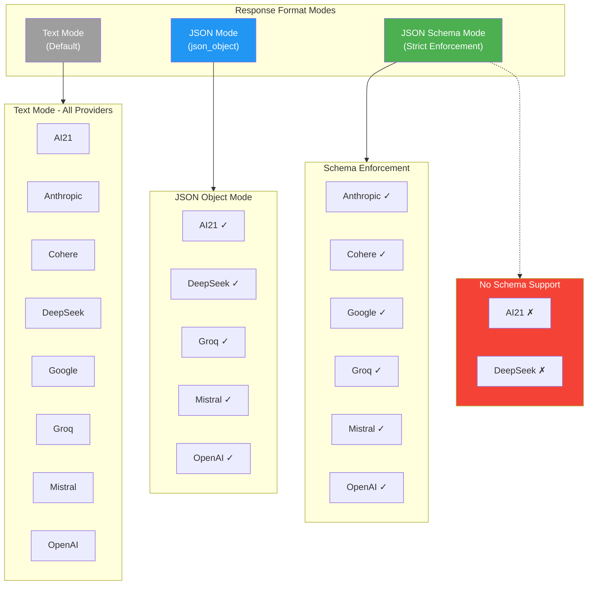
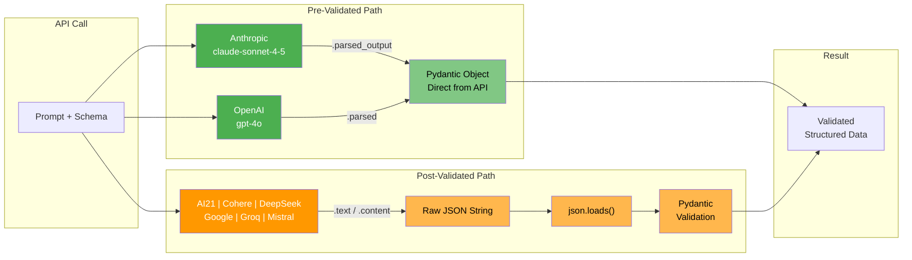
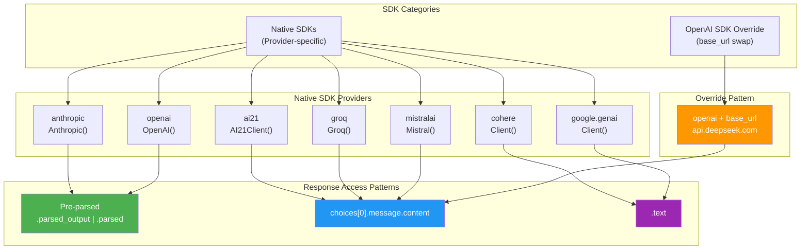
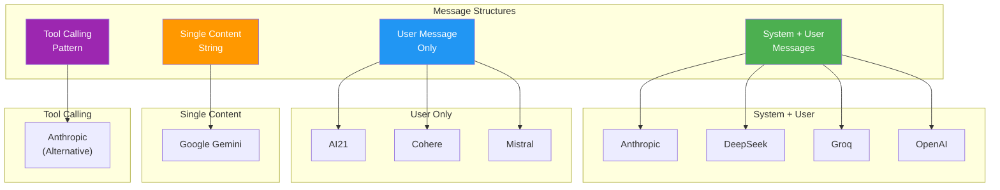
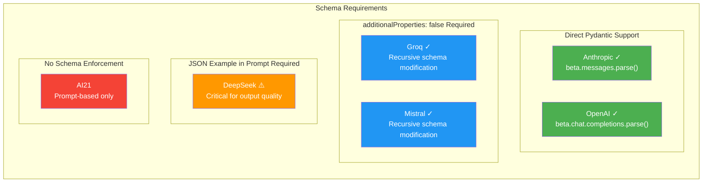
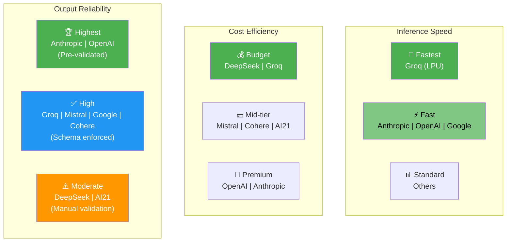

# LLM Interaction Strategy Comparison

A visual guide to the differences between 8 LLM providers for structured output generation.

---

## Visual Overview

### 1. Response Format Modes



### 2. Validation Pipeline



---

## SDK Patterns

### 3. SDK Types and Response Access



---

## Message Structure Patterns

### 4. Prompt Structure by Provider



---

## Schema Requirements Matrix

### 5. Special Requirements by Provider



---

## Provider Characteristics

### 6. Speed, Cost, and Reliability



---

## Quick Reference Tables

### Provider Comparison

| Provider | SDK | Model | Structured Output | Response Access | Key Feature |
|:---------|:----|:------|:------------------|:----------------|:------------|
| **AI21** | `ai21` native | `jamba-large` | `json_object` | `.choices[0].message.content` | Fixed 4096 tokens |
| **Anthropic** | `anthropic` native | `claude-sonnet-4-5` | `beta.messages.parse()` | `.parsed_output` | **Pre-validated Pydantic** |
| **Cohere** | `cohere` native | `command-a-03-2025` | `json_schema` | `.text` | Single message format |
| **DeepSeek** | OpenAI + base_url | `deepseek-chat` | `json_object` | `.choices[0].message.content` | **JSON example required** |
| **Google** | `google.genai` | `gemini-2.5-flash` | `response_json_schema` | `.text` | New unified SDK |
| **Groq** | `groq` native | `llama-4-scout-17b` | `json_schema` | `.choices[0].message.content` | **Fastest (LPU)** |
| **Mistral** | `mistralai` native | `mistral-small-latest` | `json_schema` | `.choices[0].message.content` | Uses `chat.complete()` |
| **OpenAI** | `openai` native | `gpt-4o` | `beta.chat.completions.parse()` | `.parsed` | **Pre-validated + refusal detection** |

### Schema Enforcement Levels

| Level | Providers | Description |
|:------|:----------|:------------|
| **🟢 Strict** | OpenAI, Anthropic | API guarantees schema compliance, returns Pydantic objects |
| **🔵 Enforced** | Cohere, Groq, Mistral, Google | API validates against schema |
| **🟡 JSON Only** | DeepSeek | Valid JSON guaranteed, schema not enforced |
| **🔴 None** | AI21 | Prompt-based guidance only |

### Retry Strategy

| Provider | Attempts | Wait Strategy | Common Issues |
|:---------|:---------|:--------------|:--------------|
| Most providers | 3 | Exponential backoff (4-60s) | Transient failures |
| **DeepSeek** | **5** | Exponential backoff | Empty responses |
| **Cohere** | 3 | **10+ seconds** | Rate limiting (429) |

---

## Response Access Code Patterns

```
┌─────────────────────────────────────────────────────────────────────────┐
│                        Response Access Patterns                          │
├─────────────────────────────────────────────────────────────────────────┤
│                                                                         │
│  PRE-VALIDATED (No manual parsing needed)                               │
│  ─────────────────────────────────────────                              │
│  Anthropic:  response.parsed_output  ──▶  Pydantic Object               │
│  OpenAI:     message.parsed          ──▶  Pydantic Object               │
│                                                                         │
│  MANUAL PARSING REQUIRED                                                │
│  ──────────────────────────                                             │
│  AI21:       response.choices[0].message.content  ──▶  json.loads()    │
│  DeepSeek:   response.choices[0].message.content  ──▶  json.loads()    │
│  Groq:       response.choices[0].message.content  ──▶  json.loads()    │
│  Mistral:    response.choices[0].message.content  ──▶  json.loads()    │
│                                                                         │
│  TEXT ACCESS                                                            │
│  ───────────                                                            │
│  Cohere:     response.text  ──▶  json.loads()                          │
│  Google:     response.text  ──▶  json.loads()                          │
│                                                                         │
└─────────────────────────────────────────────────────────────────────────┘
```

---

## Decision Trees

### Choosing a Provider

```
                              ┌─────────────────────┐
                              │ Need Structured     │
                              │ Output from LLM?    │
                              └──────────┬──────────┘
                                         │
                    ┌────────────────────┼────────────────────┐
                    ▼                    ▼                    ▼
           ┌───────────────┐    ┌───────────────┐    ┌───────────────┐
           │ Highest       │    │ Fastest       │    │ Most          │
           │ Reliability   │    │ Inference     │    │ Cost-Effective│
           └───────┬───────┘    └───────┬───────┘    └───────┬───────┘
                   │                    │                    │
                   ▼                    ▼                    ▼
           ┌───────────────┐    ┌───────────────┐    ┌───────────────┐
           │ Anthropic     │    │ Groq          │    │ DeepSeek      │
           │ OpenAI        │    │ (LPU Engine)  │    │ Groq          │
           └───────────────┘    └───────────────┘    └───────────────┘
```

### Validation Strategy

```
                              ┌─────────────────────┐
                              │ API Response        │
                              │ Received            │
                              └──────────┬──────────┘
                                         │
                    ┌────────────────────┴────────────────────┐
                    │                                         │
           ┌────────▼────────┐                       ┌────────▼────────┐
           │ Anthropic or    │                       │ Other Providers │
           │ OpenAI?         │                       │                 │
           └────────┬────────┘                       └────────┬────────┘
                    │                                         │
                    ▼                                         ▼
           ┌─────────────────┐                       ┌─────────────────┐
           │ Use .parsed_    │                       │ Extract from    │
           │ output or       │                       │ .text or        │
           │ .parsed         │                       │ .content        │
           └────────┬────────┘                       └────────┬────────┘
                    │                                         │
                    │                                         ▼
                    │                                ┌─────────────────┐
                    │                                │ json.loads()    │
                    │                                └────────┬────────┘
                    │                                         │
                    │                                         ▼
                    │                                ┌─────────────────┐
                    │                                │ Pydantic        │
                    │                                │ Validation      │
                    │                                └────────┬────────┘
                    │                                         │
                    └─────────────────┬───────────────────────┘
                                      │
                                      ▼
                              ┌───────────────┐
                              │ Validated     │
                              │ Data Object   │
                              └───────────────┘
```

---

## Critical Gotchas

### Provider-Specific Warnings

```
┌─────────────────────────────────────────────────────────────────────────┐
│                           ⚠️ CRITICAL WARNINGS                          │
├─────────────────────────────────────────────────────────────────────────┤
│                                                                         │
│  DeepSeek                                                               │
│  ─────────                                                              │
│  ⚠️ MUST include JSON example in prompt                                │
│  ⚠️ Only supports json_object mode (not json_schema)                   │
│  ⚠️ May return empty responses - use 5 retries                         │
│                                                                         │
│  Groq / Mistral                                                         │
│  ──────────────                                                         │
│  ⚠️ MUST add additionalProperties: false recursively to schema         │
│                                                                         │
│  Anthropic                                                              │
│  ─────────                                                              │
│  ⚠️ Requires beta header: structured-outputs-2025-11-13                │
│                                                                         │
│  Google Gemini                                                          │
│  ─────────────                                                          │
│  ⚠️ Doesn't support Pydantic gt/lt constraints in schema               │
│  ⚠️ Use ge/le (minimum/maximum) instead of gt/lt                       │
│                                                                         │
│  Cohere                                                                 │
│  ──────                                                                 │
│  ⚠️ May produce comma-separated numbers (3,796,742)                    │
│  ⚠️ May include markdown code blocks around JSON                       │
│  ⚠️ Needs JSON sanitization before parsing                             │
│                                                                         │
│  AI21                                                                   │
│  ────                                                                   │
│  ⚠️ No schema enforcement - must validate all output manually          │
│  ⚠️ Fixed 4096 max tokens limit                                        │
│                                                                         │
└─────────────────────────────────────────────────────────────────────────┘
```

---

## Model Self-Identification

### The Anti-Pattern

```
┌─────────────────────────────────────────────────────────────────────────┐
│                    ⛔ NEVER ASK LLMs TO SELF-IDENTIFY                   │
├─────────────────────────────────────────────────────────────────────────┤
│                                                                         │
│  Problem: LLMs cannot reliably identify themselves                      │
│                                                                         │
│  Example: DeepSeek processing 10 countries                              │
│  ├── 5 countries: Identified as "DeepSeek" ✓                           │
│  └── 5 countries: Identified as "Google Gemini" ✗                      │
│                                                                         │
│  Why: Training data contains responses from multiple models             │
│                                                                         │
│  ──────────────────────────────────────────────────────────────         │
│                                                                         │
│  ❌ BAD: Ask the model                                                  │
│     response = client.chat("Who are you?")                             │
│     # May return wrong provider!                                        │
│                                                                         │
│  ✅ GOOD: Hardcode identity                                             │
│     return ModelIdentity(                                               │
│         model_provider="DeepSeek",  # From provider class              │
│         model_name=self.model       # "deepseek-chat"                  │
│     )                                                                   │
│                                                                         │
└─────────────────────────────────────────────────────────────────────────┘
```

---

## API Key Environment Variables

| Provider | Environment Variable(s) |
|:---------|:------------------------|
| AI21 | `AI21_API_KEY` |
| Anthropic | `ANTHROPIC_API_KEY` |
| Cohere | `CO_API_KEY` or `COHERE_API_KEY` |
| DeepSeek | `DEEPSEEK_API_KEY` |
| Google | `GEMINI_API_KEY` or `GOOGLE_API_KEY` |
| Groq | `GROQ_API_KEY` |
| Mistral | `MISTRAL_API_KEY` |
| OpenAI | `OPENAI_API_KEY` |

---

## Summary: At a Glance

```
┌──────────────┬───────────┬───────────┬───────────┬───────────────────────┐
│   Provider   │  Schema   │   Speed   │   Cost    │    Best For           │
├──────────────┼───────────┼───────────┼───────────┼───────────────────────┤
│  Anthropic   │   🟢 ✓✓   │    ⚡     │    💎     │  Highest reliability  │
│  OpenAI      │   🟢 ✓✓   │    ⚡     │    💎     │  Refusal detection    │
│  Groq        │   🔵 ✓    │    🚀     │    💰     │  Speed + budget       │
│  Mistral     │   🔵 ✓    │    📊     │    💵     │  Good balance         │
│  Cohere      │   🔵 ✓    │    📊     │    💵     │  Schema support       │
│  Google      │   🔵 ✓    │    ⚡     │    💵     │  Gemini ecosystem     │
│  DeepSeek    │   🟡      │    📊     │    💰     │  Cost-effective       │
│  AI21        │   🔴      │    📊     │    💵     │  Jamba models         │
├──────────────┴───────────┴───────────┴───────────┴───────────────────────┤
│  Legend:  🟢 Pre-validated  🔵 Enforced  🟡 JSON only  🔴 None          │
│           🚀 Fastest  ⚡ Fast  📊 Standard                               │
│           💰 Budget  💵 Mid-tier  💎 Premium                            │
└──────────────────────────────────────────────────────────────────────────┘
```

---

*Last Updated: 2026-01-13*
